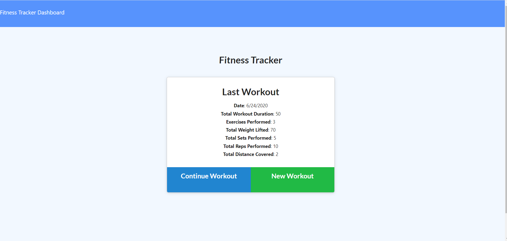

# WorkoutTracker## Workout Tracker

 ## Description
 this app allows a user to add exercises to a workout and see up to date data on their workout. 

## Table of Contents
* [intsallation](#Installation)
* [usage](#Usage)
* [Tests](#Tests)
* [User Story](#UserStory)
* [Github](#Github)

## Installation
run on heroku deplyed link  to install

## Usage
click new workout then select between cardio or resistance this allows the user to input workout types m then clicking add work out adds the workout complete adds the workout and then a second click sends the user back to the home page. 

## Tests
try these test commands: try adding some workouts then refreshing the home page! 

## UserStory
AS A fitness advocate
I WANT an app to keep track of exercises
SO THAT I can see the stats of my workouts and track my progress
## Github
profile picture:JTLaMarre
email: lordaufchaos@yahoo.com
profile picture https://github.com/JTLaMarre/WorkoutTracker